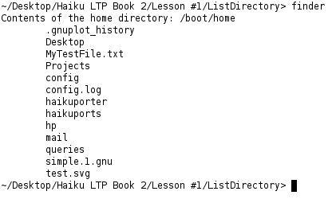
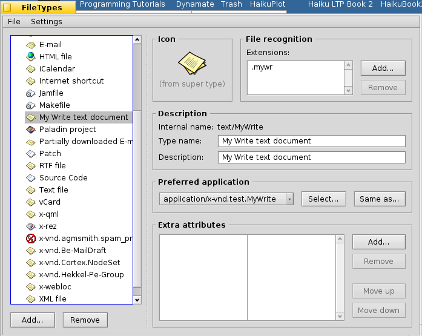
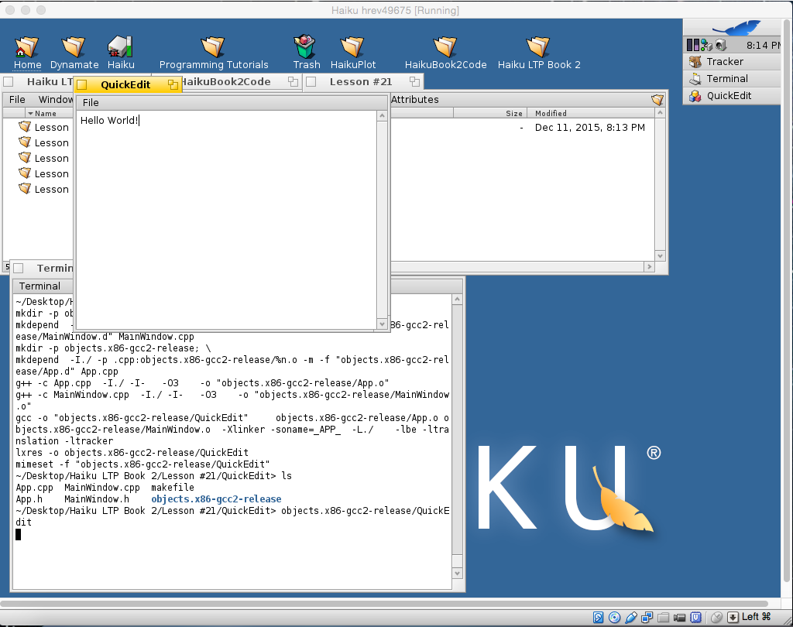
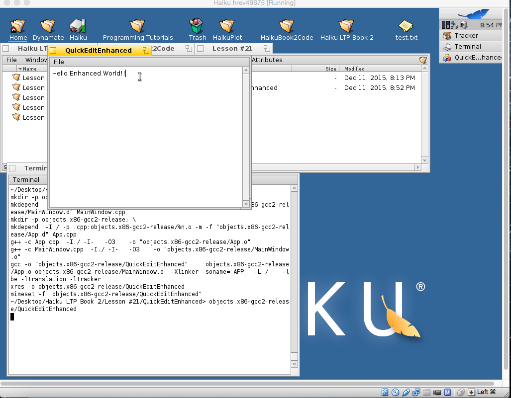

# HaikuBook2Code
Code from the assignments in Learning to Program with Haiku Book 2

Image of Lesson #1's final product:

Image of Lesson #15's final product:

Image of QuickEdit:

Image of QuickEdit Enhanced:
